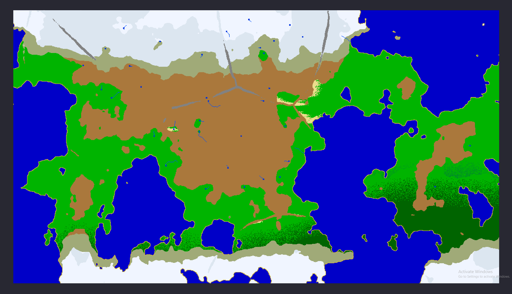
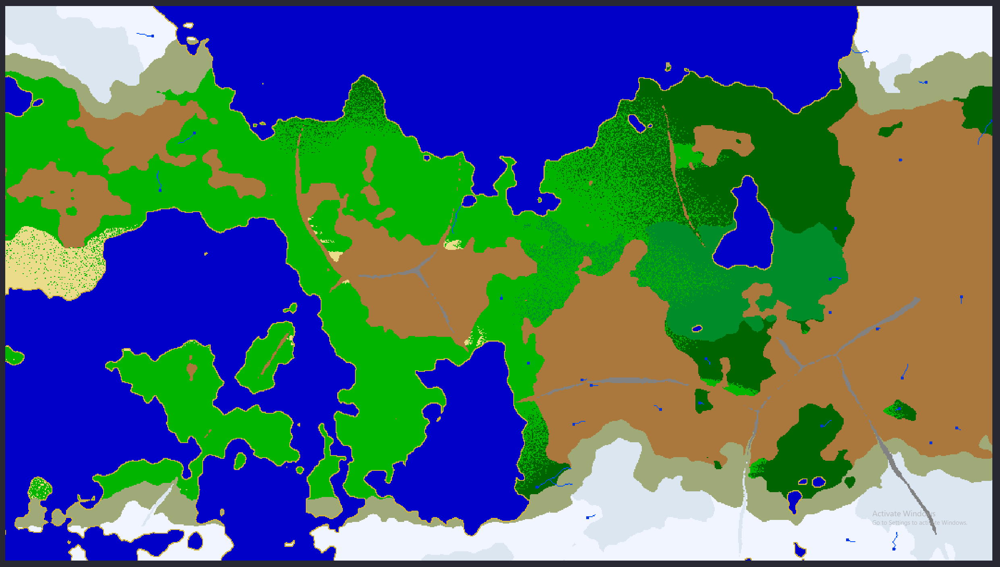
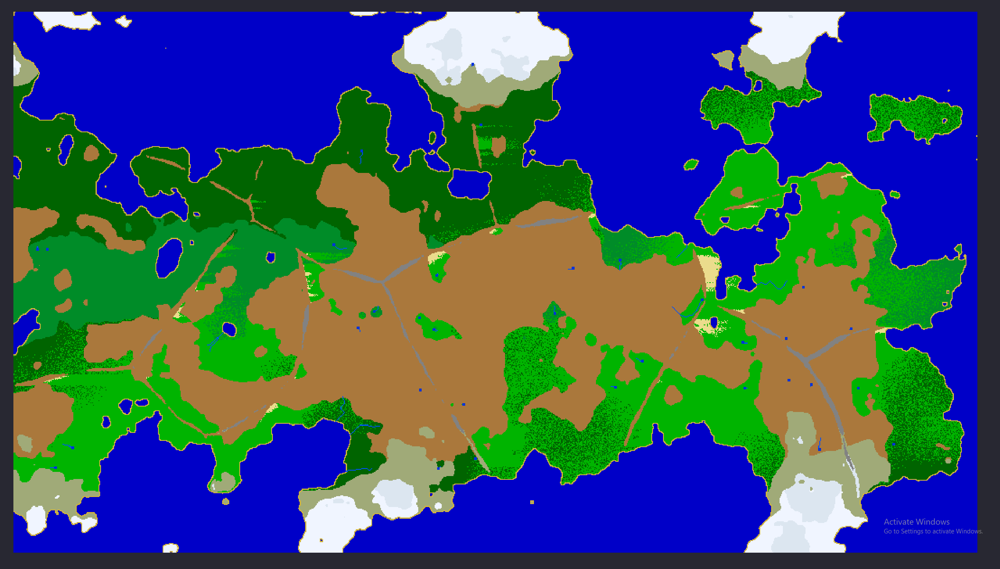
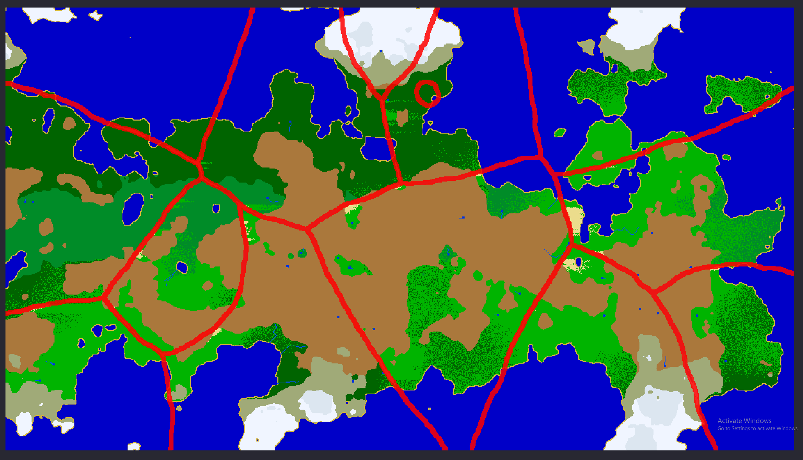
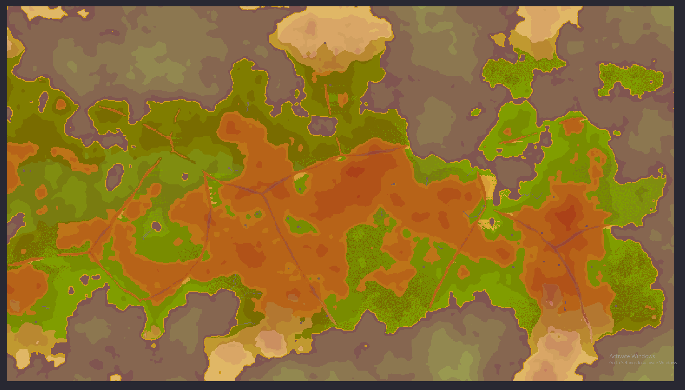
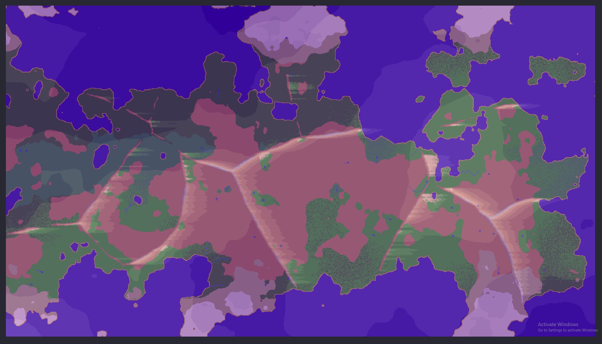
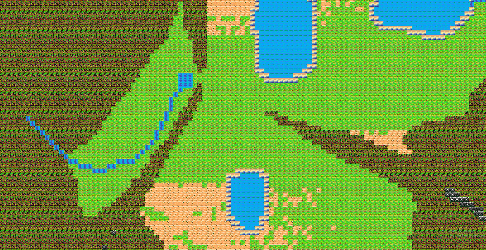
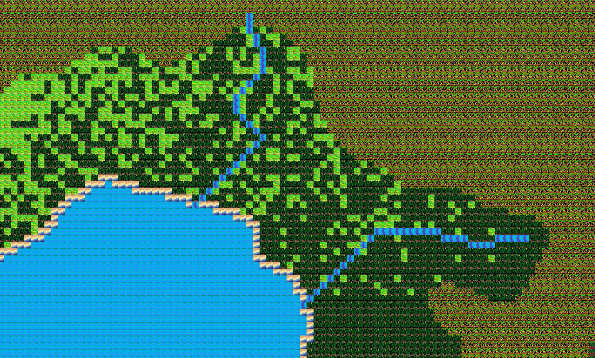

# Nation Builder Engine (working title)

Procedural 2D world generator / scuffed custom engine that *might* one day turn into a real-time Hearts of Iron 4, Civ 6-style nation builder.

Right now, it mostly generates cursed planets, lets you zoom around them, and then your GPU cries. My house hasn't burned down (yet)

Author: **Coverfish**  
Role/Abilities: *Human supervisor / button-presser / Special moves: ctrl+c or ctrl+v*  
Actual coder: **ChatGPT** (I don’t know what a variable is, I just yell at the ChatGPT)

---

## Screenshots

---

## TL;DR

- C++ + SFML full-screen 2D world viewer  
- Worlds generated from a seed (noise + tectonics + climate)  
- Height map, moisture map, tectonic plates, mountain ranges  
- Moisture shadows along mountain lines, heat map (hot at equator, cold at poles)  
- Basic biome system with rivers, lakes, deserts, swamps, beaches, etc.  
- Chunk-based rendering and texture loading depending on zoom level  
- Its own tiny engine with camera, caching, rendering, and map generation  
- Poor optimization by design for that *authentic indie dev suffering* vibe  
- Free to steal, fork, ruin, fix, commercialize, or turn into your own weird game

---

## Features

### 🌍 Procedural World Generation

Each run generates a new world using a big pile of noise and questionable math:

- **Height map** with:
  - Multi-octave noise for terrain detail  
  - Low-frequency “continent” noise for big landmasses  
  - Radial falloff so edges tend to be ocean  
- **Moisture map** with blended noise layers so forests aren’t just one big blob  
- **Tectonic plates**:
  - Several plates with warped borders  
  - Plate boundaries get uplift → mountain belts  
  - Separate tectonic debug mask for plate overlay  
- **Climate shaping**:
  - Temperature based on latitude (equator hot, poles cold) + elevation  
  - Moisture adjusted by latitude and mountain **rain shadows**  

### 🏜️ Biomes & Tiles

Tiles are chosen from elevation + moisture + temperature + tectonics:

- Water, Beach, River, Lake  
- Grass, Forest, Hill, Mountain  
- Desert, Jungle, Tundra, Snow, SnowHill, Swamp  

Status:

- Deserts: exist, kind of patchy and chaotic  
- Swamps: show up near warm wet coasts / rivers, sometimes cursed  
- Beach tiles: appear along coasts (when they feel like it)  
- Rivers & lakes: generated by flow accumulation → **very buggy**, which is part of the charm  

All “art” is self-drawn. Blame the artist, not the engine. XD

### 🔍 Debug Overlays

Press keys to switch between different map nerd modes:

- **H** – Height overlay  
- **M** – Moisture overlay  
- **T** – Tectonic belts overlay  

Normally tiles use biome-based colors (grass green, water blue, deserts yellowish, etc.).  
Overlays blend colored gradients on top:

- Height: yellow → deep red  
- Moisture: pink → dark purple  
- Tectonics: red belts at plate boundaries  

### 🎥 Camera & Controls

The whole thing is an SFML fullscreen window called **"Nation Builder Engine"**.

**Movement & input:**

- **W / A / S / D** – Move camera  
- **Mouse wheel** – Smooth zoom in/out  
- **Edge scrolling** – Move camera when the mouse hugs the window edges  
- **ESC** – Quit  
- **H / M / T** – Toggle overlays (height / moisture / tectonics)  

The camera:

- Starts zoomed out and centered  
- Smoothly lerps towards the target zoom level  
- Clamps view so you don’t fly into the void  
- Moves faster when zoomed out so you can cross continents without crying  

### 🧱 Rendering & Caching

This is technically its own mini-engine:

- Uses **tile textures** when zoomed in (grass, mountains, etc.)  
- Switches to a **color-only pixel map** when zoomed out for performance / clarity  
- World is split into big cached chunks:
  - Only visible chunks are rebuilt  
  - Caches are invalidated and re-rendered on demand  

Optimisation status:  
> “It runs on my machine™.”  
Expect frame drops, stutters, and fans taking off at some zoom levels.

---

## Controls Summary

**In-game hotkeys:**

- `W A S D` – Move camera  
- Mouse wheel – Smooth zoom  
- `H` – Height overlay  
- `M` – Moisture overlay  
- `T` – Tectonic plate belts overlay  
- `Esc` – Quit  

---

## Long-Term Dream (aka totally not scope creep)

The vague, unhinged goal:

> A real-time nation builder where you guide your nation from rocks & sticks  
> to modern geopolitics, on a fully procedural world.

Think a weird child of:

- Hearts of Iron  
- Civilization VI  
- Some real-time grand strategy  

Planned (in my brain) but not implemented yet:

- Nations, borders, cultures, population  
- Tech through ages  
- Resources, trade, conflicts  
- UI that doesn’t scream “programmer art”

Right now this is **just the world / map engine**.

---

## How to Build / Run

Rough outline:

- C++ compiler (MSVC/Clang/GCC)
- [SFML](https://www.sfml-dev.org/) installed / linked
- Clone repo
- Build the project / solution
- Run the executable; it launches in fullscreen and starts generating a world

Assets are expected in something like `assets/tiles/*.png` with names like:

- `grass.png`
- `water.png`
- `forest.png`
- `mountain.png`
- `desert.png`
- `swamp.png`
- etc.  

Feel free to replace them with your own art or programmer rectangles.

---

## License / “Steal This”

You are **officially encouraged** to:

- Steal this code  
- Fork it  
- Use it in your own game  
- Sell it  
- Break it  
- Fix it  
- Learn from it  
- Meme it  

No warranty, no support, no guarantees.

If you want to be nice, credit **Coverfish** somewhere.  
If not, that’s also fine. The code was mostly generated by an AI anyway.

Treat this as basically public domain / *“do whatever you want”* territory.

---

## Credits

- **Coverfish** – Human supervisor, idea haver, button clicker  
- **ChatGPT** – Actually wrote the Code 
- **SFML** – Rendering, windowing, input  

If this somehow turns into a real game one day, nobody will be more surprised than me.
